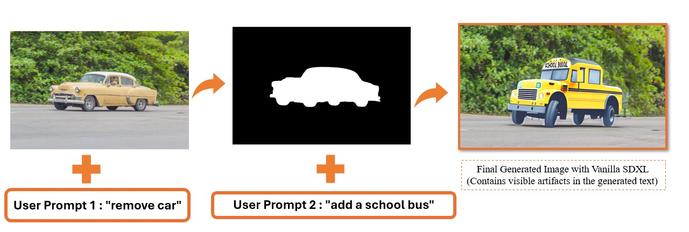

<p align="center">
  
</p>

# DeepClean: End-to-End Prompt-Guided Object Removal and Inpainting

DeepClean is a modular image editing system that supports prompt-driven object removal and replacement using an end-to-end pipeline. It also includes Stable Diffusion XL (SDXL) fine-tuning components to improve the rendering of text within inpainted regions.

---

## 🚀 Setup

Follow these steps to set up the environment:

1. Install required packages:
   ```bash
   pip install -r deepclean_requirements.txt
2. Install editable package for LoRA fine-tuning:
   ```bash
   cd deepclean/lora
   pip install -e .
3. Install editable package for language-based segmentation:
   ```bash
   cd ../language-segment-anything
   pip install -e .

## 🖼️ Run
To run the end-to-end pipeline:
  ```bash
  python main.py \
    --image_path path/to/source_image.jpg \
    --remove_prompt "prompt specifying object to remove" \
    --add_prompt "prompt specifying object to add" \
    --output_dir path/to/output/

```
Replace the arguments with your specific inputs. The output image will contain the object removed and inpainted with the desired content.

Example:
  ```bash
  python main.py \
  --image_path images/input.jpg \
  --remove_prompt "remove the car" \
  --add_prompt "add a school bus" \
  --output_dir results/
```
## 📦 Data and Checkpoints
[Google Drive Link](https://github.com/your-username/your-repository](https://drive.google.com/drive/folders/1fvw24EWZJWpUsN2ZV-2QT3I_Q77688gy?usp=drive_link
)


